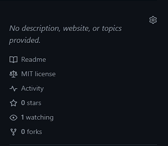

# Logseq Starter Graph

<p>


</p>

A Logseq Starter.

## ✨ Features

- Optional custom CSS themes.[^1]

## 📢 Publish Logseq Graph to GitHub Pages

Here's a step-by-step guide to publish your Logseq graph to GitHub Pages. We recommend using the [workflow](.github/workflows/logseq-publish.yml) provided with the project to publish your graph to GitHub Pages. To do so, follow the steps below.

### 1. Open the Repository Settings

At the top of the repository, click **Settings**.

<div align="center">

|  |
| --- |
</div>

### 2. Navigate to the Pages Section

On the left sidebar, click **Pages** under *Code and automation*.

<div align="center">

|  |
| --- |
</div>

### 3. Configure GitHub Pages Source to GitHub Actions

Under the *Build and deployment* section, under **Source**, change it from **Deploy from a branch** to **GitHub Actions**.

<div align="center">

|  |
| --- |
</div>

### 4. Navigate to the Actions Section

At the top of the repository, click **Actions**.

<div align="center">

|  |
| --- |
</div>

### 5. Run the Workflow for the First Time

On the left sidebar, click the workflow name (**Validate and Publish Logseq Graph to GitHub Pages**).

<div align="center">

|  |
| --- |
</div>

On the right, click **Run workflow**, then click on the new **Run workflow** (blue) button.

<div align="center">


</div>

### 6. Be Patient

⚠ Please be patient.The first time you run the workflow, it will take *several minutes* to complete. Subsequent runs will be *faster*.

Take a look at the first run for *this* repository:

<div align="center">

|  |
| --- |
</div>

Over 11 minutes!

But as you can see in the next screenshot, the next time you run the workflow, it will be much faster.

<div align="center">

|  |
| --- |
</div>

Just over 1 minute!

### 7. Use your GitHub Pages website url

Back at the repository landing page, click the ⚙ (Gear) icon to edit the repository details.

<div align="center">

|  |
| --- |
</div>

Under *Website*, click **Use your GitHub Pages website**.

<div align="center">

|  |
| --- |
</div>

It will populate the URL field with your own GitHub Pages website address. It should look like `https://your-username.github.io/logseq-starter-graph/`.

<div align="center">

|  |
| --- |
</div>

> Note: This is a good time to add a description to your project.

### 8. Save Changes

Save your changes and take a look at your repository details.

<div align="center">

|  |
| --- |
</div>

Enjoy using the Logseq Starter Graph!

## 🔀 Workflows

A breakdown of the workflows used in this project.

### Validate ✅

The [validate workflow](https://github.com/semanticdata/logseq-starter-graph/blob/main/.github/workflows/logseq-validate.yml) runs tests on the graph to identify any errors using [logseq/graph-validator](https://github.com/logseq/graph-validator).

```yml
name: Validate Logseq Graph
steps:
  - name: Checkout code
    uses: actions/checkout@v4
  - name: Run graph-validator tests
    uses: logseq/graph-validator@main
```

### Publish 📢

The [publish](https://github.com/semanticdata/logseq-starter-graph/blob/main/.github/workflows/logseq-publish.yml) workflow builds and deploys the graph to GitHub Pages using [logseq/publish-spa](https://github.com/logseq/publish-spa).

```yml
name: Publish Logseq Graph
steps:
  - name: Checkout code
    uses: actions/checkout@v4
  - name: Build Logseq graph
    uses: logseq/publish-spa@main
    with:
      output-directory: build # must match path below
  - name: Configure for GitHub Pages
    uses: actions/configure-pages@v5
  - name: Upload artifact
    uses: actions/upload-pages-artifact@v3
    with:
      path: build # must match output-directory above
  - name: Deploy to GitHub Pages
    id: deployment
    uses: actions/deploy-pages@v4
```

### Validate and Publish 🚀

A workflow that both validates and deploys to GitHub Pages (only after validation passes) is used for this project and looks like this:

```yml
name: Validate then Publish Logseq Graph
steps:
  - name: Checkout
    uses: actions/checkout@v4
  - name: Run graph-validator tests
    uses: logseq/graph-validator@main
  - name: Build Logseq graph
    uses: logseq/publish-spa@main
    with:
      output-directory: build # must match path below
      accent-color: indigo
  - name: Configure for GitHub Pages
    uses: actions/configure-pages@v5
  - name: Upload artifact
    uses: actions/upload-pages-artifact@v3
    with:
      path: build # must match output-directory above
  - name: Deploy to GitHub Pages
    id: deployment
    uses: actions/deploy-pages@v4
```

## © License

Source code in this repository is available under the [MIT License](LICENSE).

[^1]: Optional custom CSS themes can be adjusted in [logseq/config.edn](logseq/config.edn). It includes links to popular themes like: dracula, catppuccin, logseq-bear, logseq-paper, logseq-quattro, logseq-allday and logseq-dev.
